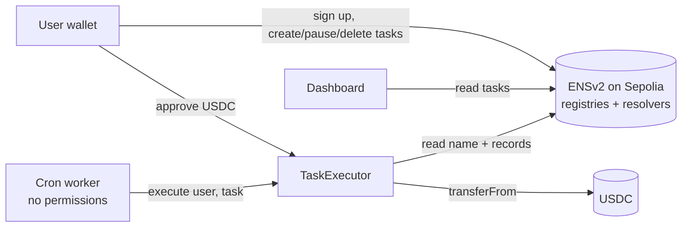

# 箱 Hako

**Every automation gets its own ENS name, and the contract only pays when the name says so.**

Hako lets anyone set up recurring token payments, where each automation lives as an ENSv2 subname like `rent.alice.hako-箱.eth`. The task's settings are stored in the name's records, its lifetime is the name's expiry, and deleting the name cancels it. A shared executor contract reads the name onchain before every payment, so a paused, expired or deleted task can never move money, no matter who calls it.

Built at ETHGlobal Tokyo 2026 for the **ENS: Best Use of ENSv2** prize.

- 🌐 **Live demo:** https://hako.lenoteddy.com
- ⛓️ **Network:** Ethereum Sepolia (ENSv2 beta)

---

## The problem

Onchain automations (recurring payments, subscriptions, scheduled transfers) usually live inside a protocol's own storage or an off-chain service. You can't easily see what's running on your behalf, share it with someone, or be sure that "cancel" really means cancelled.

## The idea

Make every automation a **name**. Names are readable by any app, owned by the user, and ENSv2 already gives them everything an automation needs: permissions, expiry, revocation and records. Hako uses those features as the product itself rather than as a label on top.

```
hako-箱.eth                      ← Hako's own subname registry
└── alice.hako-箱.eth            ← Alice's name, with her own registry + resolver
    ├── rent.alice.hako-箱.eth   ← a task: 1 USDC to 0x79F6… every minute
    └── allowance.alice.hako-箱.eth
```

| ENS concept | What it means in Hako |
|---|---|
| Subname | One automation |
| Text records | The task's settings (token, amount, recipient, interval, status) |
| Expiry | When the task stops |
| Unregistering | Deleting the task, permanently |
| Per-user subregistry | Each user owns their own namespace of tasks |
| Permissioned Resolver | Each user owns their task data |

---

## How ENSv2 is used

ENSv2 is not an add-on here. Remove it and nothing works.

**1. Hako runs its own subname registry.** `hako-箱.eth` points to a `UserRegistry` deployed through ENS's Verifiable Factory. A registrar contract (adapted from the ENS contract-developer tutorial) holds `ROLE_REGISTRAR` on it and issues user names like `alice.hako-箱.eth`.

**2. Every user gets their own registry and Permissioned Resolver.** During sign-up, the user's wallet deploys both through the Verifiable Factory and receives every role on them, then links the registry with `setSubregistry`. Hako holds no roles on a user's registry or resolver, so it cannot create or edit that user's tasks.

**3. Tasks are subnames.** Creating a task registers a label (e.g. `rent`) in the user's own registry, pointing at their resolver, with an expiry matching the task's end date.

**4. Task settings are text records.** Written to the user's Permissioned Resolver via `multicall(setText(...))`:

| Key | Example |
|---|---|
| `task.type` | `transfer` |
| `task.token` | `0x16f95d91…` (USDC) |
| `task.amount` | `1000000` (smallest unit, i.e. 1 USDC) |
| `task.recipient` | `0x79F66A70…` |
| `task.interval` | `60` (seconds) |
| `task.status` | `active` / `paused` |

The user's own name holds an index record, `hako.tasks = rent,allowance`, so any app can discover a user's automations by reading ENS alone. The dashboard has no backend or database.

**5. Enhanced Access Control decides who can do what.** The registrar holds only `ROLE_REGISTRAR | ROLE_RENEW` on Hako's registry. Each user name is registered with `ROLE_SET_SUBREGISTRY` and `ROLE_SET_RESOLVER` (plus their admin roles), which is what lets users attach their own task registry and resolver. Users hold every role on those, and the executor needs no ENS permissions at all, because it only reads.

**6. The executor reads ENS onchain, every time.** `TaskExecutor.execute(userLabel, taskLabel)` is callable by anyone. Before paying, it:

1. confirms the user name exists in Hako's registry and finds its subregistry,
2. confirms the task name exists in that subregistry (so it isn't deleted or expired),
3. requires the task's owner to be the same wallet that owns the user name,
4. reads every setting through the resolver's `resolve(name, text(node, key))` (ENSIP-10),
5. checks `task.status == "active"` and that the interval has passed,

then calls `transferFrom(owner, recipient, amount)`. Deleting or pausing the name makes the payment impossible, even for Hako's own bot.

---

## Architecture



- **`contracts/`** – `TaskExecutor.sol` (Foundry). The registrar is ENS's `SimpleSubnameRegistrar` example, deployed for `hako-箱.eth`.
- **`frontend/`** – React + viem + RainbowKit. Sign-up, task creation, dashboard, pause/resume/delete, approval and "Run now".
- **`cron/`** – A small Node worker. Every minute it discovers users from registrar events, reads each user's `hako.tasks` record, simulates `execute` and sends it only if the simulation succeeds. It pays gas but has no power over anyone's funds.

### Where to look in the code

- Executor reading ENS onchain: [`contracts/src/TaskExecutor.sol`](contracts/src/TaskExecutor.sol)
- Sign-up (deploy registry + resolver, register, `setSubregistry`): [`frontend/src/helpers/ENSHelper.js`](frontend/src/helpers/ENSHelper.js) → `signUp`
- Task creation, records and index: [`frontend/src/helpers/ENSHelper.js`](frontend/src/helpers/ENSHelper.js) → `createTask`, `listTasks`
- Pause and delete (`setText`, `unregister`): [`frontend/src/helpers/ENSHelper.js`](frontend/src/helpers/ENSHelper.js) → `setTaskStatus`, `deleteTask`
- Worker: [`cron/worker.mjs`](cron/worker.mjs)

---

## Deployed contracts (Sepolia)

| Contract | Address |
|---|---|
| `hako-箱.eth` subname registry | [`0x77891A093eE92C9B32efb16B0350F907509EE976`](https://sepolia.etherscan.io/address/0x77891A093eE92C9B32efb16B0350F907509EE976) |
| Hako registrar | [`0x8ad6d2981f60b804eaca6d98852025cc941bbd31`](https://sepolia.etherscan.io/address/0x8ad6d2981f60b804eaca6d98852025cc941bbd31) |
| TaskExecutor | [`0x3Ec3a5c062583a185F301855eBe1E2f6A8F80EDf`](https://sepolia.etherscan.io/address/0x3Ec3a5c062583a185F301855eBe1E2f6A8F80EDf) |

ENSv2 beta contracts used: ETH registry `0x657ea849…`, Verifiable Factory `0x9e726eb5…`, UserRegistry implementation `0xa80338aa…`, Permissioned Resolver implementation `0x14f09fd0…`.

---

## Try it

1. Open the [live demo](https://hako.lenoteddy.com) and connect a wallet on Sepolia.
2. **Claim a name**, e.g. `bob.hako-箱.eth`. Your wallet deploys your own registry and resolver.
3. **Create a task**: name `rent`, 1 USDC, a recipient, every minute.
4. **Allow USDC** so the executor can send it, then **Run now** (or let the worker run it).
5. **Run again immediately** → "Not due yet" (enforced by the contract).
6. **Pause** → running fails with "This task is paused".
7. **Delete** → the name is unregistered. Calling `execute` directly now reverts with `TaskNotFound`:

```bash
cast call 0x3Ec3a5c062583a185F301855eBe1E2f6A8F80EDf "execute(string,string)" <user> <task> \
  --from <owner> --rpc-url https://ethereum-sepolia-rpc.publicnode.com
```

Test ETH on Sepolia: https://cloud.google.com/application/web3/faucet/ethereum/sepolia
Test USDC on Sepolia: https://faucet.circle.com/
Test DAI on Sepolia: https://sepolia.etherscan.io/address/0x278053aCc97888E63Ec81c80FEC641Bf0Bf19664#writeContract


---

## Run locally

**Contracts**
```bash
cd contracts
forge install
forge build
```

**Frontend**
```bash
cd frontend
npm install
npm run dev
```

**Worker**
```bash
cd cron
npm install
# .env: PRIVATE_KEY=<a fresh bot wallet with a little Sepolia ETH>, RPC_URL=<Sepolia RPC>
node --env-file=.env worker.mjs
```

---

## Security model

- **User funds never leave the user's wallet until a run.** Users approve the executor for a capped amount (100 runs' worth by default), not unlimited.
- **Only the name's owner pays.** The executor pulls funds only from the wallet that owns the user name the task lives under, so nobody can create a task that spends someone else's tokens.
- **The bot is powerless.** It can only call `execute`; the contract decides whether anything happens.
- **Hako can't edit user tasks.** Each user holds all roles on their own registry and resolver.
- **Known limitation:** the `hako-箱.eth` owner still holds root roles on Hako's registry, so it could revoke a user's name (which stops their tasks, but can't redirect their funds, since payments only come from the name's current owner). Emancipating the registry by revoking those roles, as described in the ENSv2 docs, would remove this; we left it in place during the hackathon so we could fix mistakes.

---

## What we learned about ENSv2

- The Permissioned Resolver on Sepolia **writes** with `setText(bytes name, …)` but only answers **reads** through `resolve(bytes name, bytes data)`; direct `text(bytes32, …)` and `text(bytes, …)` calls revert. Contracts that read records need to go through `resolve()` (or the Universal Resolver). This cost us a few hours and would be worth a note in the docs.
- Admin roles on a name can only be granted at registration time, so role bitmaps need planning up front.
- Token IDs change when roles change, so we identify names by label hash everywhere.

---

## What's next

- More task types as names: token swaps / DCA, subscriptions, payroll.
- ENS names as recipients (`bob.eth` instead of `0x…`).
- Scoped resolver permissions so an agent can update only a task's status record.
- Agents as namespaces: an AI agent gets its own subname and can only run the tasks delegated to it.

---

## Team
- Teddy
  - Website: https://lenoteddy.com
  - Github: https://github.com/lenoteddy
  - X: https://x.com/lenoteddy